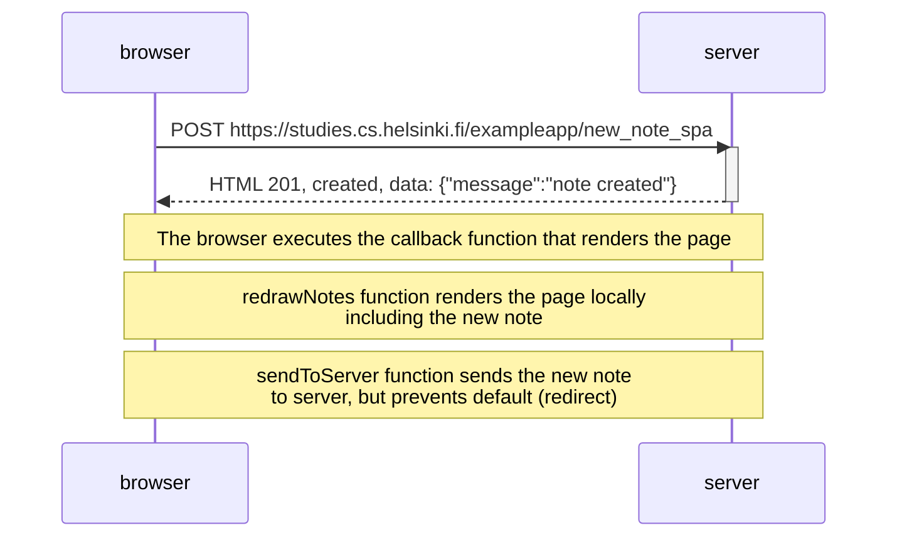

```mermaid
sequenceDiagram
    participant browser
    participant server
    browser->>server: POST https://studies.cs.helsinki.fi/exampleapp/new_note_spa
    activate server
    server-->>browser: HTML 201, created, data: {"message":"note created"}
    deactivate server
    Note over browser,server: The browser executes the callback function that renders the page
    Note over browser,server: redrawNotes function renders the page locally<br>including the new note
    Note over browser,server: sendToServer function sends the new note<br>to server, but prevents default (redirect)
```

